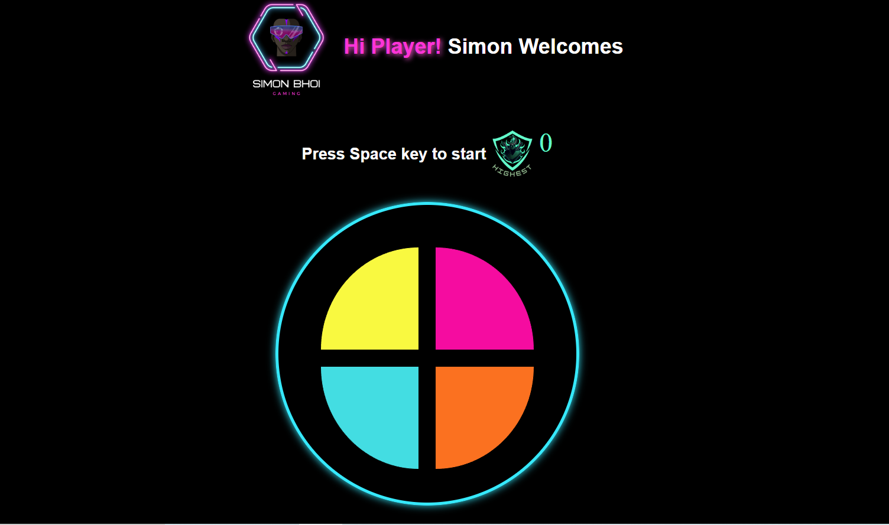

# SimonSays
An interactive game, to rigorously test the concepts of JavaScript. Beautifully designed and well built logic.

Welcome to the Simon Says game repository! This is a classic memory game where players need to remember the sequence of colors and repeat it to beat the highest score.

 <!-- Replace with a link to a demo GIF or screenshot -->

## Features

- **Memory Challenge:** Test and improve your memory skills by recalling color sequences.
- **High Score:** Compete to achieve the highest score by correctly repeating longer sequences.
- **Interactive Interface:** Enjoy a user-friendly interface with engaging colors and sounds.
- **Difficulty Levels:** Start with easy sequences and progress to more challenging ones.

## How to Play

1. Clone or download this repository.
2. Open the `index.html` file in your web browser.
3. Pay attention to the sequence of colors that light up.
4. Click on the colors in the same sequence to repeat the pattern.
5. If you make a mistake, the game will end. Your highest score will be displayed.

## Try It Out

You can try out the game by visiting the [live demo](https://your-demo-link-here.com).
